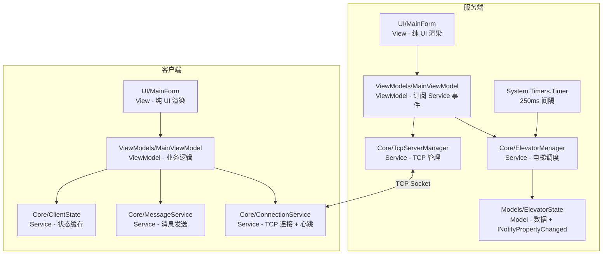

# ElevatorSimulator - 电梯模拟系统

一个基于 **.NET 10** 和 **Windows Forms** 的电梯调度模拟系统，采用 **Client-Server** 架构，通过 **TCP Socket** 进行网络通信。支持多客户端同时连接，可模拟多个用户在不同楼层呼梯、进入电梯、选择目标楼层的完整场景。

> 💡 同机运行客户端连接 `127.0.0.1:8888` 即可；跨机器联机可配合 ZeroTier / SakuraFrp 等工具实现。

## 目录

- [ElevatorSimulator - 电梯模拟系统](#elevatorsimulator---电梯模拟系统)
  - [目录](#目录)
  - [功能特性](#功能特性)
    - [服务端 (Server)](#服务端-server)
    - [客户端 (Client)](#客户端-client)
    - [电梯参数](#电梯参数)
  - [项目结构](#项目结构)
  - [技术架构](#技术架构)
    - [通信协议](#通信协议)
    - [跨机器通信](#跨机器通信)
    - [消息类型](#消息类型)
    - [项目架构](#项目架构)
    - [Look 调度算法](#look-调度算法)
  - [CI/CD 自动化](#cicd-自动化)
    - [CI 工作流 (.github/workflows/ci.yml)](#ci-工作流-githubworkflowsciyml)
    - [CodeQL 安全分析 (.github/workflows/codeql-analysis.yml)](#codeql-安全分析-githubworkflowscodeql-analysisyml)
    - [Dependabot 依赖更新 (.github/dependabot.yml)](#dependabot-依赖更新-githubdependabotyml)
    - [Dependabot 自动合并 (.github/workflows/dependabot-auto-merge.yml)](#dependabot-自动合并-githubworkflowsdependabot-auto-mergeyml)
    - [依赖审查 (.github/workflows/dependency-review.yml)](#依赖审查-githubworkflowsdependency-reviewyml)
    - [依赖提交 (.github/workflows/dependency-submission.yml)](#依赖提交-githubworkflowsdependency-submissionyml)
    - [Release 发布工作流 (.github/workflows/release-publish.yml)](#release-发布工作流-githubworkflowsrelease-publishyml)
    - [Release 清理工作流 (.github/workflows/release-delete.yml)](#release-清理工作流-githubworkflowsrelease-deleteyml)
    - [Issue / PR 模板](#issue--pr-模板)
  - [测试](#测试)
    - [运行测试](#运行测试)
    - [测试覆盖概览](#测试覆盖概览)
    - [关键测试深度](#关键测试深度)
  - [环境要求](#环境要求)
  - [构建与运行](#构建与运行)
    - [快速构建](#快速构建)
    - [发布为单文件](#发布为单文件)
    - [运行](#运行)
  - [使用说明](#使用说明)
    - [服务端操作](#服务端操作)
    - [客户端操作](#客户端操作)
  - [许可证](#许可证)

## 功能特性

### 服务端 (Server)

- **电梯调度引擎**：基于 **Look 算法** 的智能电梯调度，支持多台电梯协同运行；空闲电梯存在时优先分配给空闲电梯（忙碌电梯预测时间 ×2 惩罚），兼顾公平性与效率
- **实时状态监控**：可视化展示所有电梯的当前楼层、运行方向、门状态、开门比例和内部呼叫
- **楼层呼叫管理**：查看所有激活的楼层外部呼叫（含方向和楼层）
- **客户端管理**：查看已连接客户端列表（客户端 ID 标识），支持强制断开并自动将客户端 ID 加入黑名单 5 秒
- **心跳检测**：客户端每 4 秒发送心跳，服务端超 12 秒自动清理僵尸连接
- **日志系统**：基于 `Microsoft.Extensions.Logging` 的现代日志框架，服务端日志同时输出到 UI 面板和文件，客户端日志仅写入文件；日志文件按运行实例独立存储于 `%AppData%/Roaming/ElevatorSimulator/`，自动清理 7 天未修改的日志文件
- **单实例保护**：通过全局 Mutex 确保同一台机器仅运行一个服务端实例

### 客户端 (Client)

- **三面板界面**：欢迎界面 → 楼层等待界面 → 电梯内部界面
- **可配置连接地址**：欢迎界面可直接输入服务端 IP 和端口，支持本机、局域网、远程连接
- **防抖自动连接**：修改地址或端口后 800ms 无新输入时自动发起连接，已连接时锁定输入
- **楼层呼叫**：在楼层等待界面可发出向上/向下的外部呼叫（支持取消）
- **电梯门动画**：GDI+ 实时绘制电梯门开关动画，直观展示门状态
- **进入电梯**：当电梯到达且门打开时，可进入电梯并选择目标楼层
- **内部呼叫**：进入电梯后可点击楼层按钮发起内部呼叫（支持取消，高亮已选楼层）
- **手动开关门**：电梯停靠时可通过按钮手动控制开关门（关门过程可被开门打断，开门过程不可被打断）
- **心跳保活**：定期发送心跳保持连接，断线后自动重连恢复状态

### 电梯参数

| 参数           | 值        |
| -------------- | --------- |
| 电梯数量       | 3 台      |
| 楼层范围       | -2F ~ 33F |
| 每层行驶时间   | 3 秒      |
| 门开关时间     | 2 秒      |
| 门开启等待时间 | 4 秒      |
| 状态更新间隔   | 250 毫秒  |
| 心跳发送间隔   | 4 秒      |
| 心跳超时时间   | 12 秒     |

## 项目结构

```
ElevatorSimulator/
├── ElevatorSimulator.slnx                  # 解决方案文件
├── ReBuild.bat                             # 清理与构建脚本
├── LICENSE                                 # MIT 许可证
├── README.md
├── .github/                                # GitHub 自动化配置（CI/CD、模板、依赖更新）
│   ├── workflows/
│   │   ├── ci.yml                          # CI 工作流：自动构建、运行测试、上传结果
│   │   ├── codeql-analysis.yml             # CodeQL 代码安全漏洞扫描（每周自动执行）
│   │   ├── dependabot-auto-merge.yml       # Dependabot 自动合并：自动 approve 并 squash 合并
│   │   ├── dependency-review.yml           # 依赖审查：PR 中依赖变更时扫描已知漏洞
│   │   ├── dependency-submission.yml       # 依赖提交：向 GitHub 提交依赖快照供审查使用
│   │   ├── release-publish.yml             # Release 发布工作流：tag 触发自动发布 exe
│   │   └── release-delete.yml              # Release 清理工作流：tag 删除时自动删除 Release
│   ├── dependabot.yml                      # 自动依赖更新（NuGet 分组 + GitHub Actions 合并）
│   ├── PULL_REQUEST_TEMPLATE.md            # PR 模板（改动类型、测试清单、测试步骤）
│   └── ISSUE_TEMPLATE/
│       ├── config.yml                      # Issue 模板全局配置
│       ├── bug_report.md                   # Bug 报告模板（复现步骤、环境、日志）
│       └── feature_request.md              # 功能建议模板（背景、方案、涉及模块）
├── ElevatorSimulator.Share/                # 共享库（类库）
│   ├── Constants.cs                        # 全局常量（端口、地址、日志根目录等）
│   ├── StreamMessenger.cs                  # 基于 Stream 的消息传输工具
│   ├── Interfaces/
│   │   └── IStreamMessenger.cs             # 流消息传输器接口
│   ├── Enums/
│   │   ├── Direction.cs                    # 运行方向枚举 (None/Up/Down, Description 特性)
│   │   ├── DirectionExtensions.cs          # 方向枚举扩展 (ToSymbol 读取 Description)
│   │   ├── DoorState.cs                    # 门状态枚举 (Closed/Open/Closing/Opening)
│   │   └── MessageType.cs                  # 消息类型枚举（int 鉴别器）
│   ├── Logging/
│   │   ├── CustomLogger.cs                 # 通用 ILogger 实现（格式化后通过委托输出，支持可选类别名）
│   │   └── FileLoggerProvider.cs           # 文件日志提供程序（按运行实例独立文件，按最近修改时间清理）
│   └── Messages/
│       ├── Message.cs                      # 抽象消息基类（反射自动发现子类，无需 JsonDerivedType）
│       ├── ClientIdentityMessage.cs        # 客户端身份消息（连接后首发）
│       ├── HeartbeatMessage.cs             # 心跳消息
│       ├── ExternalCallMessage.cs           # 外部呼叫消息
│       ├── InternalCallMessage.cs           # 内部呼叫消息
│       ├── CancelExternalCallMessage.cs     # 取消外部呼叫消息
│       ├── CancelInternalCallMessage.cs     # 取消内部呼叫消息
│       ├── RequestDoorOpenMessage.cs        # 请求开门消息
│       ├── RequestDoorCloseMessage.cs       # 请求关门消息
│       ├── ElevatorStatusMessage.cs         # 电梯状态广播消息
│       └── FloorStatusMessage.cs            # 楼层状态广播消息
├── ElevatorSimulator.Server/               # 服务端（WinForms · MVVM 架构）
│   ├── Program.cs                          # 入口点（单实例 Mutex、异常处理、DI 配置）
│   ├── MessageHandlerExtensions.cs         # DI 扩展 — 自动扫描注册所有 IMessageHandler 实现
│   ├── Core/
│   │   ├── ElevatorManager.cs              # 电梯中央调度与状态管理器（纯业务层，不引用 UI）
│   │   ├── MessageRouter.cs                # 消息路由器，通过 DI 收集 Handler 并自动构建类型映射
│   │   ├── MessageRouter.Logging.cs     # 分部类 — LoggerMessage 高性能日志委托
│   │   ├── ElevatorManager.Logging.cs   # 分部类 — LoggerMessage 高性能日志委托
│   │   ├── Controllers/
│   │   │   ├── ElevatorController.cs       # 电梯控制器主文件（构造、字段）
│   │   │   ├── ElevatorController.Look.cs  # Look 调度算法实现（方向决策、目标更新）
│   │   │   ├── ElevatorController.Timer.cs # 定时器驱动的电梯状态更新（移动/停靠/门控）
│   │   │   ├── ElevatorController.Door.cs  # 门控信号（手动开关门请求）
│   │   │   ├── ElevatorController.Logging.cs # 分部类 — LoggerMessage 高性能日志委托
│   │   │   ├── ElevatorController.Tasks.cs # 任务管理（内部/外部任务的增删）
│   │   │   └── ElevatorController.Predict.cs # 呼叫预测（预估响应时间用于调度）
│   │   ├── Interfaces/
│   │   │   ├── IElevatorManager.cs         # 电梯管理器接口
│   │   │   ├── IElevatorController.cs      # 电梯控制器接口
│   │   │   ├── IServerNetworkService.cs    # 服务端网络服务接口
│   │   │   ├── IMessageHandler.cs          # 消息处理器基接口（DI 集合注入锚点）
│   │   │   └── IMessageHandler_T.cs        # 泛型消息处理器接口（编译时类型安全）
│   │   ├── MessageHandlers/
│   │   │   ├── ExternalCallHandler.cs      # 外部呼叫消息处理
│   │   │   ├── InternalCallHandler.cs      # 内部呼叫消息处理
│   │   │   ├── CancelExternalCallHandler.cs # 取消外部呼叫消息处理
│   │   │   ├── CancelInternalCallHandler.cs # 取消内部呼叫消息处理
│   │   │   ├── RequestDoorOpenHandler.cs   # 开门请求消息处理
│   │   │   └── RequestDoorCloseHandler.cs  # 关门请求消息处理
│   │   └── Networking/
│   │       ├── TcpServerManager.cs         # TCP 服务端管理器（监听、心跳、广播、黑名单）
│   │       └── TcpServerManager.Logging.cs # 分部类 — LoggerMessage 高性能日志委托
│   ├── Models/
│   │   ├── ElevatorState.cs                # 电梯逻辑状态模型 (INotifyPropertyChanged)
│   │   ├── FloorCallState.cs               # 楼层呼叫状态模型 (INotifyPropertyChanged)
│   │   └── Interfaces/
│   │       ├── IElevatorState.cs           # 电梯状态接口
│   │       └── IFloorCallState.cs          # 楼层呼叫状态接口
│   ├── ViewModels/
│   │   ├── MainViewModel.cs                # 主视图模型 — 订阅 Service 事件，转发给 View
│   │   └── Interfaces/
│   │       └── IMainViewModel.cs           # 主视图模型接口
│   ├── Logging/
│   │   └── UiLoggerProvider.cs             # UI 日志提供程序（通过事件推送到 RichTextBox，支持运行时切换级别）
│   ├── Utils/
│   │   ├── EnumItem.cs                     # 枚举辅助类（ComboBox 绑定，支持自定义描述文本）
│   │   └── EnumItem_T.cs                   # 泛型枚举辅助类
│   └── UI/
│       ├── MainForm.cs                     # 服务端主窗体（字段、构造、布局、生命周期）
│       ├── MainForm.Display.cs             # 分部类 — 状态更新、日志、绘制辅助
│       └── MainForm.WndProc.cs             # 分部类 — 窗口拖拽限制
└── ElevatorSimulator.Client/               # 客户端（WinForms · MVVM 架构）
    ├── Program.cs                          # 入口点（异常处理、DI 配置）
    ├── Core/
    │   ├── ConnectionService.cs            # 连接服务（TCP 连接生命周期、重连、心跳、消息分派字典）
    │   ├── ConnectionService.Logging.cs    # 分部类 — LoggerMessage 高性能日志委托
    │   ├── MessageService.cs               # 消息服务（泛型 SendAsync<T>，新增消息无需改接口）
    │   ├── MessageService.Logging.cs       # 分部类 — LoggerMessage 高性能日志委托
    │   ├── ClientState.cs                  # 客户端状态存储（电梯/楼层状态缓存、进出判断）
    │   ├── Interfaces/
    │   │   ├── IConnectionService.cs       # 连接服务接口（继承 IStreamAccessor）
    │   │   ├── IMessageService.cs          # 消息发送服务接口
    │   │   ├── IClientState.cs             # 客户端状态接口
    │   │   ├── IStreamAccessor.cs          # 网络流访问器接口
    │   │   └── ITransportConnection.cs     # 传输连接抽象接口
    │   └── Networking/
    │       └── TcpTransportConnection.cs   # ITransportConnection 的 TCP 实现
    ├── ViewModels/
    │   ├── MainViewModel.cs                # 主视图模型 — 封装连接管理、进出电梯、呼叫逻辑
    │   ├── MainViewModel.Logging.cs        # 分部类 — LoggerMessage 高性能日志委托
    │   └── Interfaces/
    │       └── IMainViewModel.cs           # 主视图模型接口
    ├── Enums/
    │   ├── PanelType.cs                    # 面板类型枚举 (Welcome/Floor/Elevator)
    │   └── ConnectionStatus.cs             # 连接状态枚举 (Connecting/Connected/Reconnecting/Closed)
    └── UI/
        ├── MainForm.cs                     # 客户端主窗体（字段、构造、布局、生命周期）
        ├── MainForm.Panels.cs              # 分部类 — 三个面板的 Build 方法
        ├── MainForm.Events.cs              # 分部类 — UI 状态刷新、面板切换
        ├── MainForm.Animation.cs           # 分部类 — 动画定时器、方向符号、WndProc
        └── ElevatorDrawPanel.cs            # 电梯门动画绘制面板（GDI+）
├── ElevatorSimulator.Server.Test/          # 服务端测试（xUnit + Moq, 124 个测试）
├── ElevatorSimulator.Client.Test/          # 客户端测试（xUnit + Moq, 50 个测试）
└── ElevatorSimulator.Share.Test/           # 共享库测试（xUnit, 34 个测试）
```

## 技术架构

### 通信协议

```
┌──────────┐                       ┌──────────┐
│  Client  │◄───── TCP Socket ────►│  Server  │
│  (多个)  │     (可跨机器)         │  (单例)  │
└──────────┘                       └──────────┘
```

- **传输层**：TCP Socket（基于 `TcpClient` / `TcpListener`，默认端口 8888）
- **帧格式**：`[4 字节长度前缀 (Little Endian)] + [JSON 消息体]`
- **序列化**：`System.Text.Json`，通过反射自动发现 `Message` 子类并结合 `MessageType` 枚举（int 鉴别器）实现多态序列化，新增消息类型无需修改任何序列化配置
- **客户端身份**：连接建立后，客户端首发 `ClientIdentityMessage` 声明自己的 GUID 标识；服务端以此 ID 管理连接和黑名单

### 跨机器通信

本机调试直接连接 `127.0.0.1:8888`。跨机器联机推荐以下方式：

| 方式             | 适用场景               | 说明                                 |
| ---------------- | ---------------------- | ------------------------------------ |
| **局域网**       | 同一 WiFi / 路由器下   | 客户端直接填服务端局域网 IP          |
| **ZeroTier**     | 跨网络、免费、稳定     | 创建虚拟局域网，各设备获得虚拟 IP    |
| **SakuraFrp**    | 客户端不想安装额外软件 | 服务端电脑运行 frp 客户端映射端口    |
| **云服务器中转** | 长期稳定、完全可控     | 租一台轻量云服务器跑 EasyTier 做中转 |

### 消息类型

```
Message (抽象基类, 子类由 StreamMessenger 反射自动发现，通过 MessageType 枚举作为 JSON $type 鉴别器)
客户端 → 服务端：
├── ClientIdentityMessage     (0) 客户端身份声明（连接后首发，含自生成 GUID）
├── HeartbeatMessage          (1) 心跳保活
├── ExternalCallMessage       (2) 楼层外部呼叫
├── InternalCallMessage       (3) 电梯内部呼叫
├── CancelExternalCallMessage (4) 取消外部呼叫
├── CancelInternalCallMessage (5) 取消内部呼叫
├── RequestDoorOpenMessage    (6) 请求手动开门
└── RequestDoorCloseMessage   (7) 请求手动关门
服务端 → 客户端：
├── FloorStatusMessage        (100) 楼层呼叫状态广播
└── ElevatorStatusMessage     (101) 电梯状态广播
```

### 项目架构

项目采用 **MVVM（Model-View-ViewModel）** 架构，严格遵循依赖方向：**View → ViewModel → Service → Model**。Service 层和 Model 层不引用任何 UI 命名空间（`System.Windows.Forms` 等），通过事件机制向上通知状态变化。



**依赖规则**：View 可引用 ViewModel/Service；ViewModel 可引用 Service/Model；Service 绝不引用 View 或 ViewModel。

**关键设计**：
- 服务端 `ElevatorManager` / `TcpServerManager` 通过 `event` 向上通知状态变化，不再直接调用 `UI.MainForm.Instance`
- 客户端 `ConnectionService` 负责 TCP 连接生命周期（含心跳和自动重连），内部通过字典映射 `Type → Action<Message>` 分派消息；`MessageService` 使用泛型 `SendAsync<T>()` 发送消息；`ClientState` 负责缓存电梯和楼层状态
- 日志系统基于 `Microsoft.Extensions.Logging`，通过内置 `ILogger<T>` 注入；日志输出使用 `[LoggerMessage]` 源生成器实现零分配高性能日志；异常捕获遵循 `catch (OperationCanceledException) { } catch (Exception ex) { LogXxx(...); }` 模式，静默忽略预期的取消操作，记录真正的异常
- CheckBox 控件使用"比较守卫"模式区分用户操作与服务端同步：`Checked == 服务端状态` 时为服务端同步（跳过请求），否则为用户操作（发送请求）
- 连接状态使用 `ConnectionStatus` 枚举表达 4 种状态（Connecting / Connected / Reconnecting / Closed），UI 通过字典映射驱动显示文本和颜色
- 遵循开闭原则（OCP）：新增消息类型仅需添加消息类 + Handler 类 + 枚举值，无需修改 `Message`、`MessageRouter`、`IMessageService`、`Program.cs`；新增 UI 面板仅需构建方法 + 字典注册一行

### Look 调度算法

电梯控制器采用经典的 **Look 算法**（电梯算法变体），核心实现在 `ElevatorController.Look.cs`：

1. **目标更新** (`UpdateTarget`)：电梯沿当前方向移动，依次服务同方向上所有请求
2. 同方向无更多请求时，反向移动并服务反方向请求
3. 所有任务完成后，方向重置为 `None`
4. **呼叫预测** (`PredictTimeToServeExternalCall`，位于 `ElevatorController.Predict.cs`)：预估每台电梯的响应时间，选择最优电梯分配
5. **任务管理** (`ElevatorController.Tasks.cs`)：内部/外部任务的增删，任务完成自动清理
6. **状态驱动** (`ElevatorController.Timer.cs`)：定时器（250ms）驱动移动、停靠、门状态机
7. **门控信号** (`ElevatorController.Door.cs`)：手动开关门请求的缓存与处理
8. **公平性策略** (`ElevatorManager.AddFloorCall`)：有空闲电梯时，忙碌电梯的预测时间加倍惩罚，避免新呼叫插队已有乘客

## CI/CD 自动化

本项目使用 GitHub Actions 实现持续集成、安全扫描、依赖管理和自动发布。配置文件位于 `.github/` 目录。

> **前置条件**：Dependabot 自动合并功能需要在仓库 `Settings → Actions → General` 中开启 **Allow GitHub Actions to create and approve pull requests**，使 `github-actions[bot]` 的审批计入分支保护要求的审批数。

### CI 工作流 (.github/workflows/ci.yml)

每次向 `main`/`develop` 分支推送代码或发起 Pull Request 时，自动执行以下步骤：

| 步骤          | 操作                      | 说明                                       |
| ------------- | ------------------------- | ------------------------------------------ |
| 1. Checkout   | `actions/checkout@v7`     | 拉取仓库代码到 CI 环境                     |
| 2. Setup .NET | `actions/setup-dotnet@v5` | 安装 .NET 10 SDK                           |
| 3. Restore    | `dotnet restore`          | 还原所有 NuGet 依赖包                      |
| 4. Build      | `dotnet build -c Release` | Release 模式编译整个解决方案               |
| 5. Test       | `dotnet test` + coverlet  | 运行全部 208 个 xUnit 测试并收集代码覆盖率 |
| 6. Upload     | `upload-artifact@v7`      | 上传测试结果（保留 7 天可下载）            |
| 7. Report     | `dorny/test-reporter@v3`  | 在 PR 评论中显示测试通过/失败摘要          |

运行环境固定为 `windows-latest`（项目依赖 Windows Forms）。

### CodeQL 安全分析 (.github/workflows/codeql-analysis.yml)

GitHub 官方代码安全扫描工具，自动检测 C# 代码中的安全漏洞和代码质量问题：

- **触发时机**：push/PR 到 `main` 分支时执行；此外每周一 UTC 0:00（北京时间 8:00）定时扫描
- **扫描结果**：上报到仓库的 **Security → Code scanning** 面板，可在该页面查看和修复

### Dependabot 依赖更新 (.github/dependabot.yml)

每周一北京时间 8:00 自动检查依赖更新，有新版本时自动提交 PR：

| 管理对象       | 更新内容                                          | 分组策略                                                                   |
| -------------- | ------------------------------------------------- | -------------------------------------------------------------------------- |
| NuGet 包       | `Microsoft.Extensions.*`、`xunit*`、`coverlet` 等 | 同类包合并（4 组）：`microsoft-extensions` / `xunit` / `test-sdk` / 兜底组 |
| GitHub Actions | `checkout@v7`、`setup-dotnet@v5` 等               | 全部合并为 1 个 PR（`all-actions` 组），最多同时 5 个                      |

更新的 PR 会自动打上 `dependencies` 标签，便于筛选和处理。

### Dependabot 自动合并 (.github/workflows/dependabot-auto-merge.yml)

当 Dependabot 创建或更新 PR 时，工作流使用内置 `GITHUB_TOKEN` 自动完成以下操作：

| 步骤                 | 说明                                                                  |
| -------------------- | --------------------------------------------------------------------- |
| 1. Approve           | 以 `github-actions[bot]` 身份提交 approving review，满足 1 个审批要求 |
| 2. Enable auto-merge | 开启自动合并（squash 策略），CI 全部通过后自动合并                    |

- **安全保障**：仅当 PR 作者为 `dependabot[bot]` 时才触发，其他来源的 PR 不受影响
- **零配置**：使用内置 `GITHUB_TOKEN`，无需额外创建 PAT；权限声明 `contents: write` + `pull-requests: write`

### 依赖审查 (.github/workflows/dependency-review.yml)

每次 PR 时自动扫描依赖变更是否包含已知漏洞和许可证问题：

- 扫描结果直接评论在 PR 中，无需进入单独页面查看
- 支持增量审查：结合依赖快照，仅报告 PR 引入的新问题
- 快照缺失时自动重试等待（`retry-on-snapshot-warnings`），避免误报
- 与 CodeQL 互补：CodeQL 扫描代码，Dependency Review 扫描依赖

### 依赖提交 (.github/workflows/dependency-submission.yml)

每次向 `main`/`develop` 分支推送或发起 PR 时，自动检测并提交项目依赖快照：

| 步骤          | 操作                                                                        | 说明                                       |
| ------------- | --------------------------------------------------------------------------- | ------------------------------------------ |
| 1. Checkout   | `actions/checkout@v7`                                                       | 拉取仓库代码                               |
| 2. Setup .NET | `actions/setup-dotnet@v5`                                                   | 安装 .NET 10 SDK                           |
| 3. Submit     | `advanced-security/component-detection-dependency-submission-action@v0.1.1` | 静态扫描 .csproj 解析 NuGet 依赖并提交快照 |

> 依赖快照是 Dependency Review 进行增量审查的基础，可精准定位每次 PR 引入的依赖变更。

### Release 发布工作流 (.github/workflows/release-publish.yml)

推送以 `v` 开头的 tag（如 `v1.0.0`）时自动触发发布流程：

| 步骤          | 操作                                   | 说明                                  |
| ------------- | -------------------------------------- | ------------------------------------- |
| 1. Checkout   | `actions/checkout@v7`                  | 拉取仓库代码                          |
| 2. Setup .NET | `actions/setup-dotnet@v5`              | 安装 .NET 10 SDK                      |
| 3. Test       | `dotnet test`                          | 运行全部 208 个测试，不通过则阻断发布 |
| 4. Publish    | `dotnet publish -c Release -r win-x64` | 发布服务端和客户端为单文件自包含 exe  |
| 5. Release    | `softprops/action-gh-release@v3`       | 创建 GitHub Release 并上传两个 exe    |

发布产物为两个独立的可执行文件，无需安装 .NET 运行时即可运行：
- `ElevatorSimulator.Server.exe`
- `ElevatorSimulator.Client.exe`

**使用方式**：
```batch
git tag v1.0.0
git push origin v1.0.0
```

### Release 清理工作流 (.github/workflows/release-delete.yml)

当删除以 `v` 开头的 tag 时，自动查找并删除对应的 GitHub Release：

- 通过 GitHub API 精确匹配 `tag_name`，避免遗漏
- 若找不到对应 Release 则静默跳过，不报错

### Issue / PR 模板

确保每次协作都遵循统一规范：

| 文件                                | 何时生效              | 包含内容                                                           |
| ----------------------------------- | --------------------- | ------------------------------------------------------------------ |
| `PULL_REQUEST_TEMPLATE.md`          | 新建 PR 时自动填充    | 描述、关联 Issue、改动类型（9 类勾选）、测试清单（4 项）、测试步骤 |
| `ISSUE_TEMPLATE/bug_report.md`      | 新建 Bug Issue 时选择 | 描述、复现步骤、预期行为、运行环境、日志粘贴区                     |
| `ISSUE_TEMPLATE/feature_request.md` | 新建功能建议时选择    | 背景问题、期望方案、替代方案、涉及模块（服务端/客户端/通信协议）   |
| `ISSUE_TEMPLATE/config.yml`         | Issue 页面全局        | 允许空白 Issue、添加 README 文档链接                               |

## 测试

项目采用 **xUnit + Moq** 测试框架，共 **208 个单元测试**，覆盖核心业务逻辑、调度算法、状态机和并发安全。

### 运行测试

```batch
# 运行全部测试
dotnet test

# 运行指定项目
dotnet test ElevatorSimulator.Server.Test
```

### 测试覆盖概览

| 测试项目        | 测试数 | 覆盖重点                                                                                                                                                                                                                                                                                                                                                                                |
| --------------- | ------ | --------------------------------------------------------------------------------------------------------------------------------------------------------------------------------------------------------------------------------------------------------------------------------------------------------------------------------------------------------------------------------------- |
| **Share.Test**  | 34     | 消息多态序列化往返、Stream 二进制协议、损坏数据处理、`CustomLogger`/`FileLoggerProvider` 日志系统、`DirectionExtensions` 方向符号映射                                                                                                                                                                                                                                                   |
| **Server.Test** | 124    | 电梯状态机全生命周期（门动画 Opening→Open→Closing→Closed→移动）、Look 算法预测（多门状态/中途停靠/边界楼层/哨兵任务）、2× 惩罚调度算法（空闲优先/全忙无惩罚/全空闲）、任务增删与方向决策、门控信号与请求优先级、`ElevatorState`/`FloorCallState` 属性变更通知、`TcpServerManager` 黑名单与客户端生命周期、`MessageRouter` 路由分发、`EnumItem`/`FormatFloorList` 工具类、多线程并发安全 |
| **Client.Test** | 50     | 连接生命周期（身份消息发送/重复连接取消）、`ClientState` 进出电梯边界条件（`Opening`/`Closing`/`Closed` 门状态）、`MainViewModel` 面板切换与门请求、`MessageService` 异常静默处理                                                                                                                                                                                                       |

### 关键测试深度

- **电梯状态机**：通过反射调用 `HandleStopped`/`HandleMoving`/`HandleDoorRequests` 私有方法，精确验证每个定时器周期内的状态转换
- **调度算法**：Mock 3 台电梯的不同预测时间和移动方向，验证 2× 惩罚在空闲/忙碌/全忙场景下的正确性
- **并发安全**：多线程同时增删任务、读写状态属性，验证 `lock`/`ConcurrentDictionary` 的正确性
- **完成态任务清理**：验证 `CompleteCurrentFloorTask` 从 `ElevatorState` 和 `FloorCallState` 中正确移除已完成呼叫

## 环境要求

- **操作系统**：Windows 10 / 11 x64
- **运行时**：[.NET 10.0 SDK](https://dotnet.microsoft.com/download/dotnet/10.0)
- **开发工具**：Visual Studio 2022+ 或 VS Code（推荐安装 C# Dev Kit 扩展）

## 构建与运行

### 快速构建

```batch
# 方式一：使用构建脚本（清理 bin/obj 后重新构建）
ReBuild.bat

# 方式二：直接使用 dotnet CLI
dotnet build
```

### 发布为单文件

```batch
dotnet publish -c Release
```

发布配置已启用 `PublishSingleFile` 和 `SelfContained`，生成独立可执行文件。

### 运行

分别启动服务端和客户端：

```batch
# 启动服务端
start ElevatorSimulator.Server\bin\Release\net10.0-windows\win-x64\publish\ElevatorSimulator.Server.exe

# 启动客户端（可多次启动模拟多用户）
start ElevatorSimulator.Client\bin\Release\net10.0-windows\win-x64\publish\ElevatorSimulator.Client.exe
```

## 使用说明

### 服务端操作

1. 启动服务端后自动开始监听客户端连接
2. **电梯状态**面板：查看 3 台电梯的实时状态，双击行可查看内部呼叫详情
3. **楼层呼叫**面板：查看所有激活的外部呼叫
4. **客户端管理**面板：右键可强制断开指定客户端
5. **日志**面板：通过下拉框过滤日志级别，点击"清空日志"清空显示

### 客户端操作

1. **欢迎界面**：
   - 输入服务端 IP 和端口，修改后自动发起连接
   - 点击"关闭连接"按钮可断开连接并禁止自动重连（再次点击恢复）
   - 连接状态标签显示：正在连接...（蓝色）→ ✓ 已连接到服务器（绿色）或 连接已关闭（灰色）
   - 选择要进入的楼层（-2F ~ 33F），也可点击"随机"按钮随机选择
   - 连接成功后"进入楼层"按钮亮起
2. **楼层等待界面**：
   - 点击 ↑/↓ 按钮切换外部呼叫（按下=绿色=已激活，弹起=取消）
   - 观察电梯门动画，当电梯到达且门打开时，"进入电梯"按钮亮起
3. **电梯内部界面**：
   - 点击楼层按钮切换内部呼叫（按下=绿色=已选择，再次点击取消）
   - 观察右侧门动画
   - 点击"◀▶" / "▶◀"按钮手动控制电梯门（仅电梯停靠时可用）
   - 电梯停靠且门打开后，点击"退出电梯"返回楼层等待界面

## 许可证

本项目基于 [MIT License](LICENSE) 开源。

---

**作者**：xiting910
**年份**：2026
